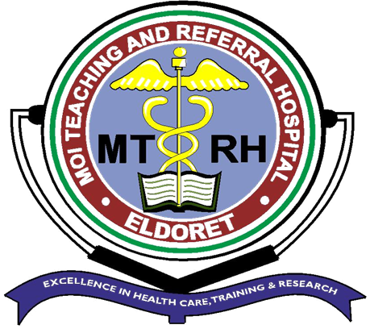
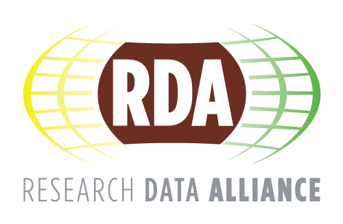
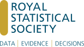
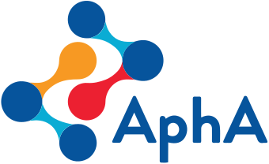

---
execute: 
  freeze: true
anchor-sections: true
---

<link href="https://cdnjs.cloudflare.com/ajax/libs/font-awesome/6.0.0-beta3/css/all.min.css" rel="stylesheet">

<!-- Centering the title -->

<h1 style="text-align: center; margin-bottom: 0;">
  Linus Chirchir
</h1>

  Population and Health Data Scientist 
  Edinburgh, Scotland, United Kingdom

  <i class="fas fa-id-badge"></i>
  <a href="https://orcid.org/0000-0003-2687-5967" target="_blank">ORCID</a>

  |

  <i class="fas fa-graduation-cap"></i>
  <a href="https://scholar.google.com/citations?user=0DCF9mwAAAAJ&hl=en" target="_blank">Google Scholar</a>

  |

  <i class="fas fa-book"></i>
  <a href="https://www.scopus.com/authid/detail.uri?authorId=57217593474" target="_blank">Scopus</a>

  |

  <i class="fas fa-chart-line"></i>
  <a href="https://www.webofscience.com/wos/author/record/AAP-3550-2020" target="_blank">Web of Science</a>

## <i class="fas fa-user"></i> Personal Profile

Population and Health Data Scientist specialising in the preparation, documentation, linkage, and analysis of large-scale administrative datasets across health, education, and social research. Combination of academic qualifications and applied experience in UK Trusted Research Environments TREs), synthetic data, metadata, and research data infrastructure to support evidence-informed research, policy, and public benefit.

## <i class="fas fa-search"></i> Research Interests

Population health, health inequalities, life-course analysis, social determinants of health, nursing and midwifery workforce research, administrative data research, record linkage, longitudinal data analysis, TREs, synthetic data, metadata, data stewardship, research data infrastructure, machine learning, and evidence-informed policy.

## <i class="fas fa-briefcase"></i> Work Experience

::: {.d-inline-flex style="align-items:baseline"}
::: p-2
[{width="80px" fig-alt="RDS Logo"}](https://www.researchdata.scot/about-rds/our-people/)
:::

::: h3
[Research Data Scotland](https://www.researchdata.scot/about-rds/our-people/){target="_blank"}, Edinburgh, United Kingdom, Data Analyst, 09/2024 - Present
:::
:::

-   Assess the suitability of administrative datasets for ingestion into Scotland’s National Safe Haven and linkage to other research datasets, identifying appropriate methods for collation, preparation, and updating, including data cleaning and quality assurance.

-   Update datasets already held within the National Safe Haven, ensuring they meet current standards and requirements.

-   Follow established processes and produce comprehensive documentation to track progress and aid researchers in understanding the purpose and content of the datasets, including preparing data dictionaries and collating metadata.

-   Coordinate and communicate with external partner organisations to ensure dataset processing aligns with business objectives.

-   Report progress to team members and external partner organisations to ensure effective delivery of the data sourcing pathway.

::: {.d-inline-flex style="align-items:baseline"}
::: p-2
[{width="80px" fig-alt="RDS Logo"}](https://www.ed.ac.uk/profile/linus-chirchir)
:::

::: h3
[University of Edinburgh](https://www.ed.ac.uk/profile/linus-chirchir){target="_blank"}, Edinburgh, United Kingdom, Health Data Analyst, 09/2023 - 06/2024
:::
:::

-   Utilised SQL and R to clean and merge datasets, consolidating over 13,000 records from various Excel files into a unified dataset, which reduced data processing time by 50% and improved data accessibility for analysis by 30%.

-   Leveraged R for comprehensive analyses of NHS and administrative datasets, applying statistical techniques to generate actionable insights that directly impacted service improvements for over 500 patients. Developed and implemented R-based data analysis pipelines, optimising statistical efficiency and data quality, resulting in a 20% increase in data processing speed and a 15% reduction in data errors, enhancing research accuracy.

-   Contributed to manuscripts for peer-reviewed journals, ensuring methodological rigour and reproducibility through R-generated analyses. This effort led to a 25% increase in publication acceptance rates, enhancing the visibility and impact of the research.

-   Developed an Orthopaedic Surgery Dashboard using Shiny, featuring interactive visualisations that displayed demographics, patient-reported measures, consultant performance metrics, and patient satisfaction. The Dashboard provided valuable insights, reducing manual data analysis time by 40%, increasing data-driven decision-making by 50%, and improving patient care outcomes, contributing to a 15% increase in overall patient satisfaction.

-   Engaged collaboratively in weekly meetings, serving as the liaison between the Data Controller and Research Database Manager, aligning project goals and data requirements, improving project completion timelines by 10%, and facilitating better team coordination.

::: {.d-inline-flex style="align-items:baseline"}
::: p-2
[{width="80px" fig-alt="RDS Logo"}](https://www.mtrh.go.ke/)
:::

::: h3
[Moi Teaching and Referral Hospital](https://www.mtrh.go.ke/){target="_blank"}, Eldoret, Kenya, ICT Officer/Researcher, 07/2008 - 12/2021
:::
:::

-   Identified, analysed, and interpreted trends and patterns in 104 health-related datasets, leading to actionable insights that improved healthcare service delivery, resulting in a 15% increase in patient satisfaction.

-   Formed hypotheses and tested ideas to determine the viability of operational outcomes, resulting in data-driven recommendations that optimised resource allocation and enhanced service efficiency, saving the organisation approximately 10% in operational costs.

-   Used SQL to develop KPIs in collaboration with cross-functional teams, resulting in a 103% increase in organic traffic to the organisational website, significantly enhancing its visibility and reach.

-   Collaborated with department managers to identify and correct data problems, improving data accuracy and reliability, which enhanced data analysis effectiveness by 40%.

-   Led the development and implementation of interactive data visualisations within the organisation, increasing user engagement by 35% and improving data comprehension among stakeholders.

## <i class="fas fa-chalkboard-teacher"></i> Teaching Experience

::: {.d-inline-flex style="align-items:baseline"}
::: p-2
[{width="80px" fig-alt="RDS Logo"}](https://www.uoeld.ac.ke/)
:::

::: h3
[University of Eldoret](https://www.uoeld.ac.ke/){target="_blank"}, Eldoret, Kenya, Part-time Lecturer, 01/2015 - 12/2021
:::
:::

-  **Courses Taught:** Introduction to Computer Science, Introduction to Computers and Computing, Introduction to Internet and Web Design, Intermediate Hypertext Mark-up Language, Operating Systems, Data Communication and Computer Networks, Decision Support Systems and Expert Systems, Advanced Database Systems.

## <i class="fas fa-graduation-cap"></i> Education

::: {.d-inline-flex style="align-items:baseline"}
::: p-2
[{width="80px" fig-alt="RDS Logo"}](https://www.swansea.ac.uk/postgraduate/taught/medicine/health-data-science-msc-pgdip-pgcert/)
:::

::: h3
[Swansea University](https://www.swansea.ac.uk/postgraduate/taught/medicine/health-data-science-msc-pgdip-pgcert/){target="_blank"}, Swansea, United Kingdom, Master of Science in Health Data Science, 01/2022 - 05/2023
:::
:::

::: {.d-inline-flex style="align-items:baseline"}
::: p-2
[{width="80px" fig-alt="RDS Logo"}](https://www.usiu.ac.ke/742/mba-health-leadership-management/)
:::

::: h3
[United States International University - Africa](https://www.usiu.ac.ke/742/mba-health-leadership-management/){target="_blank"}, Nairobi, Kenya, Master of Business Administration, 09/2018 - 08/2019
:::
:::

::: {.d-inline-flex style="align-items:baseline"}
::: p-2
[{width="80px" fig-alt="RDS Logo"}](https://kisiiuniversity.ac.ke/%D7%97%D7%96%D7%99%D7%AA%D7%99l/d/school-of-information-technology/academics)
:::

::: h3
[Kisii University](https://kisiiuniversity.ac.ke/%D7%97%D7%96%D7%99%D7%AA%D7%99l/d/school-of-information-technology/academics){target="_blank"}, Kisii, Kenya, Master of Information Systems, 01/2014 - 12/2015
:::
:::

::: {.d-inline-flex style="align-items:baseline"}
::: p-2
[{width="80px" fig-alt="RDS Logo"}](https://business.mu.ac.ke/index.php/undergraduate-programmes/42-programmes/undergraduate/119-bachelor-of-business-management-bbm)
:::

::: h3
[Moi University](https://business.mu.ac.ke/index.php/undergraduate-programmes/42-programmes/undergraduate/119-bachelor-of-business-management-bbm){target="_blank"}, Eldoret, Kenya, Bachelor of Business Management (Business Information Systems Management), 09/2008 - 12/2012
:::
:::

## <i class="fas fa-award"></i> Grant Funding

**Principal Investigator – £64,508.43, March 2026**
  
Awarded funding for **FRAME-DS: Framework for Recognising Applied Data Stewardship Within TRE Workforces – A Collaborative, Cross-Organisation Pilot** through the UKRI-funded [Careers and Skills for Data-Driven Research (CaSDaR) Network+](https://casdar.ac.uk/announcing-the-results-of-casdars-funding-call-round-1/){target="_blank"} Research Technical Professional Call, part of Grant No. UKRI739.

## <i class="fas fa-medal"></i> Honours and Recognition

**UKRI-Endorsed Global Talent Recipient, May 2026**  

Endorsed by [UK Research and Innovation (UKRI)](https://www.ukri.org/apply-for-funding/getting-a-global-talent-visa-to-do-research-in-the-uk/){target="_blank"} under the [Global Talent Endorsed Funder](https://www.gov.uk/global-talent-researcher-academic/uk-research-innovation-endorsement){target="_blank"} route in recognition of contributions to UKRI-funded research and innovation activities through [Administrative Data Research UK (ADR UK)](https://www.adruk.org/){target="_blank"} and [Research Data Scotland](https://www.researchdata.scot/work-and-impact/current-projects/adr-scotland-partnership/){target="_blank"}, supporting the secure and responsible use of administrative data for research and public benefit.

## <i class="fas fa-cogs"></i> Technical Skills

* **Programming and Statistical Analysis:** R, SQL, SPSS, and Advanced Excel.

* **Statistical Methods:** Longitudinal and cohort analysis, demographic and population data analysis, regression modelling (linear, logistic, Poisson, negative binomial, Cox proportional hazards, and multilevel/mixed-effects models), epidemiological analysis, causal inference, record linkage, machine learning, spatial analysis, and hypothesis testing.

* **Data Visualisation and GIS:** R, Tableau, Power BI, QGIS, and ArcGIS.

* **Research Data Infrastructure:** Metadata standards, data governance, Trusted Research Environments (TREs), synthetic data generation, data quality assurance, administrative data research, and reproducible analytical pipelines (RAPs).

* **Reproducible Research and Version Control:** Quarto, Git, and GitHub.

## <i class="fas fa-hands-helping"></i> Peer Review, Mentorship and Research Engagement

* **Member, [ESRC Peer Review College](https://www.ukri.org/wp-content/uploads/2025/11/ESRC-141125-PeerReviewCollegeMembersNovember2025.pdf){target="_blank"}** (10/2025 – Present)
  Expert reviewer for grant applications in population methods, data science, and social statistics.

* **Peer Reviewer** (03/2021 – Present)
Reviewed 19 manuscripts across seven journals, including the [International Journal of Population Data Science](https://ijpds.org/peer-review){target="_blank"}, [Journal of Medical Internet Research (JMIR)](https://www.jmir.org/){target="_blank"}, [JMIR Medical Informatics](https://medinform.jmir.org/){target="_blank"}, [JMIR Bioinformatics and Biotechnology](https://bioinform.jmir.org/){target="_blank"}, [JMIR Perioperative Medicine](https://periop.jmir.org/){target="_blank"}, and [JMIR Formative Research](https://formative.jmir.org/){target="_blank"}, and [PLoS ONE](https://journals.plos.org/plosone/){target="_blank"}.

* **[Certified Publons Academy Supervisor (Mentor)](https://www.webofscience.com/wos/author/record/AAP-3550-2020){target="_blank"}** (09/2020 – 04/2021)
Mentored six trainees on the Publons Academy Practical Peer Review Training Course, providing structured feedback and final review assessments.

## <i class="fas fa-users"></i> Professional Affiliations

::: {.d-flex style="align-items:baseline"}
::: p-2
[{width="80px" fig-alt="RDA Logo"}](https://www.rd-alliance.org/)
:::

[Research Data Alliance](https://www.rd-alliance.org/members/linuschirchir/){target="_blank"}, Member, 01/2026 - Present
:::

::: {.d-flex style="align-items:baseline"}
::: p-2
[{width="80px" fig-alt="DSP Logo"}](https://rss.org.uk/)
:::

[Royal Statistical Society Data Science Professional Status](https://rss.org.uk/membership/professional-development/data-science-professional/){target="_blank"}, 04/2026 - Present
:::

::: {.d-flex style="align-items:baseline"}
::: p-2
[{width="80px" fig-alt="AdvFEDIP Logo"}](https://www.fedip.org/public-register)
:::

[The Federation for Informatics Professionals Advanced Practitioner FEDIP](https://www.credly.com/badges/77959f5a-a602-409d-aadb-1a4b47baafce){target="_blank"}, 12/2025 - Present
:::

::: {.d-flex style="align-items:baseline"}
::: p-2
[{width="80px" fig-alt="GradStat Logo"}](https://rss.org.uk/)
:::

[Royal Statistical Society Graduate Statistician Status](https://rss.org.uk/membership/professional-register/){target="_blank"}, 11/2025 - Present
:::

::: {.d-flex style="align-items:baseline"}
::: p-2
[{width="80px" fig-alt="Data Analyst Logo"}](https://rss.org.uk/)
:::

[Royal Statistical Society Data Analyst Status](https://rss.org.uk/membership/professional-register/){target="_blank"}, 12/2024 - 11/2025
:::

::: {.d-flex style="align-items:baseline"}
::: p-2
[{width="80px" fig-alt="RSS Logo"}](https://rss.org.uk/)
:::

[Royal Statistical Society](https://rss.org.uk/){target="_blank"}, Member, 08/2024 - Present
:::

::: {.d-flex style="align-items:baseline"}
::: p-2
[{width="80px" fig-alt="AphA Logo"}](https://www.aphanalysts.org/)
:::

[Association of Professional Healthcare Analysts (AphA)](https://www.aphanalysts.org/){target="_blank"}, Member, 02/2022 - Present
:::

## <i class="fas fa-certificate"></i> Certifications and Training

-   EPSRC and ESRC Peer Review Training, November 2025

-   Office for National Statistics Safe Researcher Training, June 2025

-   ISO/IEC 27001:2013 Information Security Management Systems Lead Audit Course, 25th - 30th October 2021

-   ISO 9001:2015 Quality Management Systems Internal Auditor Course, 8th - 11th December 2020

-   ISO/IEC 27001:2013 Information Security Management Systems Internal Auditor Course, 20th - 22nd June 2018

-   ISO/IEC 27001:2013 Information Security Management Systems Lead Implementer Course, 13th - 14th and 16th June 2018

## <i class="fas fa-file-alt"></i> Publications

### <i class="fas fa-microphone"></i> Peer Reviewed Conferences

- 	**Chirchir, L.**, (2025). Automating Low-Fidelity Synthetic Data Generation from Metadata: A Reproducible Approach Using R. International Journal of Population Data Science, 10(4). <a href="https://doi.org/10.23889/ijpds.v10i4.3134" target="_blank">https://doi.org/10.23889/ijpds.v10i4.3134</a>.

- 	Bishop, J., **Chirchir, L.**, Coey, R., Dunlop, A., Evans, H., Grzybowski, D., Harbinson, A., Magder, C., McCullough, N., McFerran, R., Muir, J., Ramage, A., Telford, S., Thomas, R. and Vilcan, T. (2025). ADRUK Ingest Improvement Task and Finish Group: Smoothing the ingest of data. International Journal of Population Data Science, 10(4). <a href="https://doi.org/10.23889/ijpds.v10i4.3130" target="_blank">https://doi.org/10.23889/ijpds.v10i4.3130</a>.

-   **Chirchir, L. K.**, Aruasa, W. K., Kugo, L. C., Rop, C. C., & Mwogi, T. S. Investigating the Use of Facebook by Medical Institutions in Kenya. PACIS 2021 Proceedings. 230. <a href="https://aisel.aisnet.org/pacis2021/230/" target="_blank">https://aisel.aisnet.org/pacis2021/230/</a>.

-   **Chirchir, L. K.**, Aruasa, W. K., & Chebon, S. K. (2021). Change Process Factors Influencing Electronic Health Records Adoption by Nurses at Moi Teaching and Referral Hospital, Kenya. Procedia Computer Science, 181, 427–433. <a href="https://doi.org/10.1016/j.procs.2021.01.187" target="_blank">https://doi.org/10.1016/j.procs.2021.01.187</a>.

-   **Chirchir, L. K.**, Aruasa, W. K., & Chebon, S. K. (2020). Determining Role of Social Factors in Adoption of Electronic Health Records by Nurses. Studies in Health Technology and Informatics, 272, 111–114. <a href="https://doi.org/10.3233/SHTI200506" target="_blank">https://doi.org/10.3233/SHTI200506</a>.

### <i class="fas fa-book-open"></i> Peer Reviewed Journal Articles

-   **Chirchir, L. K.**, Aruasa, W. K., & Chebon, S. K. (2021). Technical Factors Influencing Electronic Health Records Adoption by Nurses at Moi Teaching and Referral Hospital, Kenya. African Journal of Science, Technology, Innovation and Development, 13(5), 551 - 558. <a href="https://doi.org/10.1080/20421338.2020.1777676" target="_blank">https://doi.org/10.1080/20421338.2020.1777676</a>.

-   Aruasa, W. K., **Chirchir, L. K.**, & Chebon, S. K. (2019). Implications of Physicians and Nurses’ Professional Satisfaction on Patient Care. International Journal of Public Health Science (IJPHS), 8 (3), 300 – 306. <a href="http://doi.org/10.11591/ijphs.v8i3.20238" target="_blank">http://doi.org/10.11591/ijphs.v8i3.20238</a>.

-   Chebon, S. K., Aruasa, W. K., & **Chirchir, L. K.** (2019). Effect of Inspirational Motivation and Idealized Influence on Employee Performance at Moi Teaching and Referral Hospital, Eldoret, Kenya. International Journal of Business and Social Science, 10(7), 131 – 140. <a href="http://doi.org/10.30845/ijbss.v10n7p14" target="_blank">http://doi.org/10.30845/ijbss.v10n7p14</a>.

-   Aruasa, W. K., **Chirchir, L. K.**, & Chebon, S. K. (2019). Determinants of Physicians and Nurses’ Professional Satisfaction at the Moi Teaching and Referral Hospital, Eldoret, Kenya. Journal of Health, Medicine and Nursing, 64, 6 – 17. <a href="http://doi.org/10.7176/JHMN/64-02" target="_blank">http://doi.org/10.7176/JHMN/64-02</a>.

-   Aruasa, W. K., **Chirchir, L. K.**, & Chebon, S. K. (2019). [Strategies for Improving Physicians and Nurses’ Professional Satisfaction at the Moi Teaching and Referral Hospital, Eldoret, Kenya](https://www.strategicjournals.com/index.php/journal/article/view/1275){target="_blank"}. The Strategic Journal of Business & Change Management, 6 (3), 216 – 226.

-   Chebon, S. K., Aruasa, W. K., & **Chirchir, L. K.** (2019). [Influence of Individualized Consideration and Intellectual Stimulation on Employee Performance: Lessons from Moi Teaching and Referral Hospital, Eldoret, Kenya](https://iosrjournals.org/iosr-jhss/papers/Vol.%2024%20Issue7/Series-4/B2407041122.pdf){target="_blank"}. IOSR Journal of Humanities and Social Science, 24 (7), 11 – 22.

-   **Chirchir, L. K.**, Aruasa, W. K., & Chebon, S. K. (2019). [Perceived Usefulness and Ease of Use as Mediators of the Effect of Health Information Systems on User Performance](https://eajournals.org/ejcsit/vol-7-issue-1-february-2019/perceived-usefulness-and-ease-of-use-as-mediators-of-the-effect-of-health-information-systems-on-user-performance/){target="_blank"}. European Journal of Computer Science and Information Technology, 7 (1), 22 – 37.

-   Ireri, E. N., Omondi, Y. A., **Chirchir, L. K.**, & Wafula, M. K. (2015). [Adoption of Enterprise Resource Planning System in Kenya: A Case Study of Kenya Ordnance Factories Corporation](https://www.journalcra.com/article/adoption-enterprise-resource-planning-system-kenya-case-study-kenya-ordnance-factories){target="_blank"}. International Journal of Current Research, 7 (4), 14702 – 14711.
